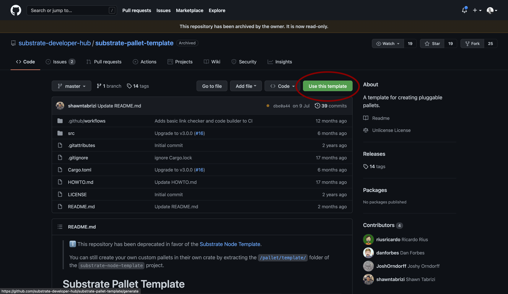
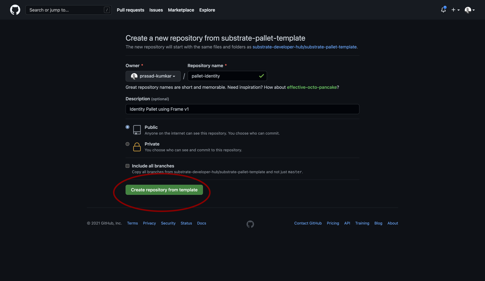
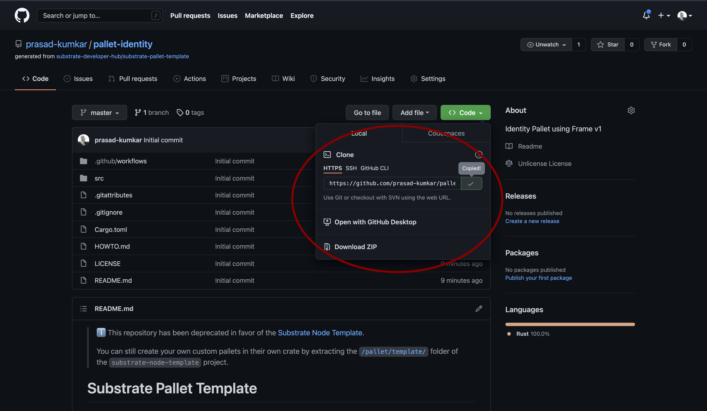

# How to build Custom Pallets with Substrate

# Introduction
In this tutorial, we will be building a custom pallet using the substrate development framework and FRAME v1. Pallet

### Pre-requisite
Familiarity with Rust Programming Language
Knowledge of Substate Framework

### Pallets
Pallets are domain-specific runtime modules, which allows us to have a modular design. We could add multiple pallets to our runtime.

Some of the most popular pre-build pallets could be found [here.](https://substrate.dev/docs/en/knowledgebase/runtime/frame#prebuilt-pallets)

### FRAME v1
FRAME is the framework to develop pallets, it comes with set of libraries and modules to get started. Following is the skeleton of a FRAME based pallet:
1. Imports and Dependencies

The pallet supports the use of any Rust library which compiles with the `no_std` flag.
``` rust
use support::{decl_module, decl_event, decl_storage, ...}
```
2. Runtime Config Trait

All of the runtime types and consts go in here. If the pallet is dependent on specific other pallets, then their configuration traits should be added to the inherited traits list.
```rust
pub trait Config: frame_system::Config { ... }
```
3. Runtime Events

Events are a simple means of reporting specific conditions and circumstances that have happened that users, Dapps and/or chain explorers would find interesting and otherwise difficult to detect.<br>
[Read more about Runtime Events](https://substrate.dev/docs/en/knowledgebase/runtime/events)
```rust
decl_event! { ... }
```
4. Runtime Storage 

This allows for type-safe usage of the Substrate storage database, so you can keep things around between blocks.
<br>
[Read more about Runtime Storage](https://substrate.dev/docs/en/knowledgebase/runtime/storage)
```rust
decl_storage! { ... }
```
5. Runtime Errors

This is a enum allows to define custom error types which could be called from the runtime module.
```rust
decl_error! { ... }
```
6. Runtime Module 

This defines the `Module` struct that is ultimately exported from this pallet. It defines the callable functions that this pallet exposes and orchestrates actions this pallet takes throughout block execution.
```rust
decl_module! { ... }
```
We will now take a look at how can build our own pallet with this above framework.

[More details about FRAME](​​https://substrate.dev/docs/en/knowledgebase/runtime/frame)

# Getting Started
## Using the Template Pallet
We can start off using the Substrate pallet template, which provides provides the starter code using Frame v1

[Link to Substrate Pallet Template](https://github.com/substrate-developer-hub/substrate-pallet-template)






Now you can clone the generated repository onto your local machine by running the following command in your terminal/command-line
```bash
git clone https://github.com/<YOUR_GITHUB_USERNAME>/pallet-identity.git
```


## A look at template code
First we are importing the rust macros from frame_support library, which are required to build our runtime module `decl_module`, storage `decl_storage`, events `decl_event`, errors `decl_error`, `dispatch` for DispatchResult and `Get` trait is used by storage to convert types.

We have also been importing `ensure_signed` from `frame_system` to check if transactions are signed.
```rust
#![cfg_attr(not(feature = "std"), no_std)]

use frame_support::{decl_module, decl_storage, decl_event, decl_error, dispatch, traits::Get};
use frame_system::ensure_signed;

#[cfg(test)]
mod mock;

#[cfg(test)]
mod tests;
```
### Configuration
```rust
pub trait Config: frame_system::Config {
	/// Because this pallet emits events, it depends on the runtime's definition of an event.
	type Event: From<Event<Self>> + Into<<Self as frame_system::Config>::Event>;
}

```
### Declaring Storage

Here the pallet's storage name `TemplateModule` should be different from other pallets' storage name. 

`Something` is a storage item, which can store an optional unsigned 32bit integer. This storage item can be accessed from the runtime module using the `something()` function. We can define more storage items if we want.

[Heres more about Storage Items](https://substrate.dev/docs/en/knowledgebase/runtime/storage#declaring-storage-items)

```rust
decl_storage! {
	trait Store for Module<T: Config> as TemplateModule {
		Something get(fn something): Option<u32>;
	}
}
```
Runtime supports emitting specified events on method calls. We can pass in arguments with each event, here `SomethingStored` emit a unsigned 32bit integer and an AccountId

Declaration of the events would be done here:
```rust
decl_event!(
	pub enum Event<T> where AccountId = <T as frame_system::Config>::AccountId {
		SomethingStored(u32, AccountId),
	}
);
```

We can declare events here with this enum, which can be called from the module calls. This informs the user that something went wrong
```rust
decl_error! {
	pub enum Error for Module<T: Config> {
		NoneValue,
		StorageOverflow,
	}
}
```
### Runtime Module
This is where we declare method calls (transactions) which could be used to modify/query chain state, they could also emit events and errors.

`Dispatchable functions allows users to interact with the pallet and invoke state changes. These functions materialize as "extrinsics", which are often compared to transactions. Dispatchable functions must be annotated with a weight and must return a DispatchResult.`

Defining weight lets us define how much gas should the function call cost.
```rust
decl_module! {
	pub struct Module<T: Config> for enum Call where origin: T::Origin {
		// Errors must be initialized if they are used by the pallet.
		type Error = Error<T>;

		// Events must be initialized if they are used by the pallet.
		fn deposit_event() = default;

		/// An example dispatchable that takes a singles value as a parameter, writes the value to
		/// storage and emits an event. This function must be dispatched by a signed extrinsic.
		#[weight = 10_000 + T::DbWeight::get().writes(1)]
		pub fn do_something(origin, something: u32) -> dispatch::DispatchResult {
			// Check that the extrinsic was signed and get the signer.
			// This function will return an error if the extrinsic is not signed.
			// https://substrate.dev/docs/en/knowledgebase/runtime/origin
			let who = ensure_signed(origin)?;

			// Update storage.
			Something::put(something);

			// Emit an event.
			Self::deposit_event(RawEvent::SomethingStored(something, who));
			// Return a successful DispatchResult
			Ok(())
		}

		/// An example dispatchable that may throw a custom error.
		#[weight = 10_000 + T::DbWeight::get().reads_writes(1,1)]
		pub fn cause_error(origin) -> dispatch::DispatchResult {
			let _who = ensure_signed(origin)?;

			// Read a value from storage.
			match Something::get() {
				// Return an error if the value has not been set.
				None => Err(Error::<T>::NoneValue)?,
				Some(old) => {
					// Increment the value read from storage; will error in the event of overflow.
					let new = old.checked_add(1).ok_or(Error::<T>::StorageOverflow)?;
					// Update the value in storage with the incremented result.
					Something::put(new);
					Ok(())
				},
			}
		}
	}
}
```
# Designing a Custom Pallet
In our example we are designing an identity pallet, where:
- Users could generate a new identity
- Add/remove attributes to that identity
- Delete the identity

For that we would require the following storage:


[Reference](https://substrate.dev/docs/en/knowledgebase/runtime/pallets)